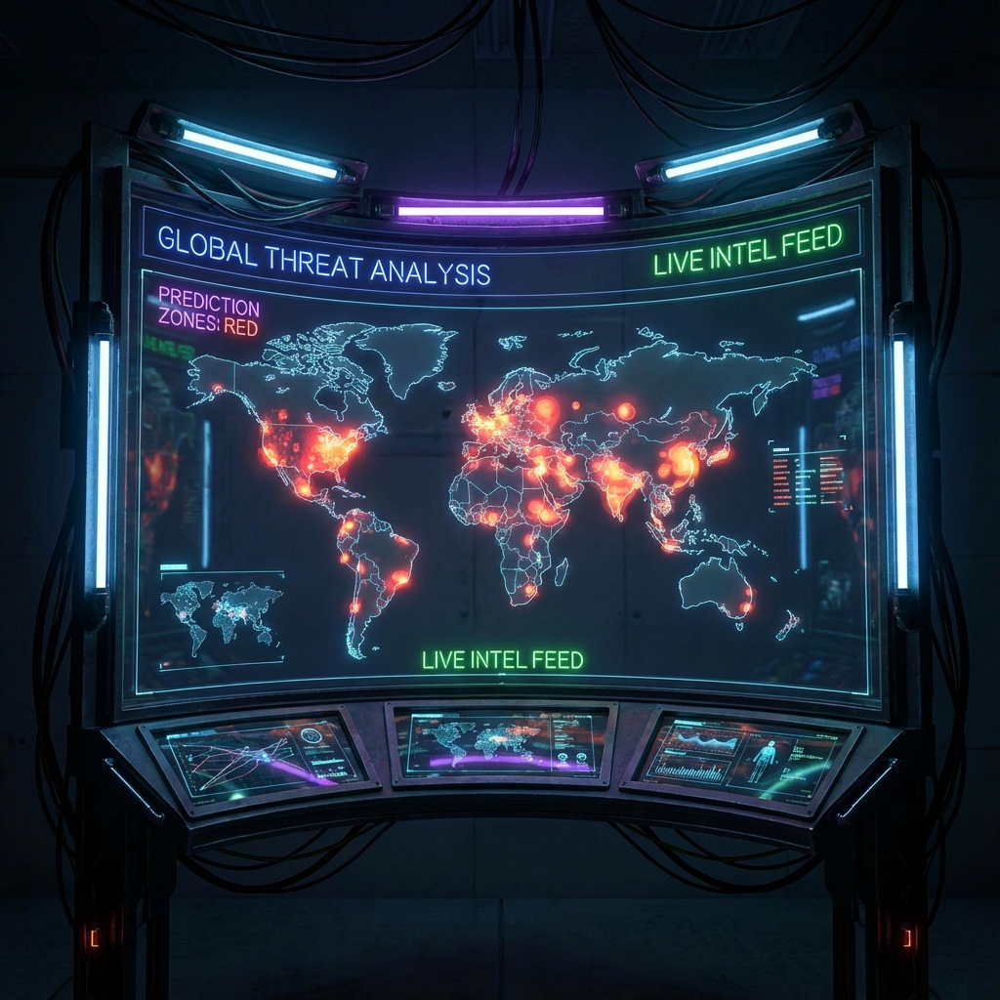

  <table border="0">
    <tr>
      <td width="60%" align="left">
        <h1>Hi, I'm Vedant! </h1>
        
         
        <b>AI-driven Software Engineer | Full-Stack Developer</b> 
        🎓 MS in Computer Science @ Syracuse University
          
        🔭 I’m currently working on  <b>Multi-Agent Systems & AI Agent</b> 
        🌱 I’m currently learning  <b>Advanced LLM Fine-tuning & RAG Pipeline </b> 
        👯 I’m looking to collaborate on  <b>Open Source AI Tools </b> 
        💬 Ask me about <b>Python, React, AI Agents, and scalable systems </b>
          
         
        
        
        
      </td>
      <td width="40%" align="center">
        
      </td>
    </tr>
  </table>

 

---

  

 

  <table border="0" width="100%">
    <tr>
      <td width="55%" align="left">
        <h3>💻 Tech Stack</h3>
        <table border="0">
          <tr>
            <td width="20%"><b>Languages</b></td>
            <td></td>
          </tr>
          <tr>
            <td width="20%"><b>AI & Data</b></td>
            <td>
              
              
            </td>
          </tr>
          <tr>
            <td width="20%"><b>Backend</b></td>
            <td></td>
          </tr>
          <tr>
            <td width="20%"><b>DevOps</b></td>
            <td></td>
          </tr>
          <tr>
            <td width="20%"><b>Frontend</b></td>
            <td></td>
          </tr>
        </table>
      </td>
      <td width="45%" align="center">
         
        
      </td>
    </tr>
  </table>

  

<h2 align="center">🚀 Featured Projects</h2>

<table width="100%">
<tr>
<td width="50%">
<a href="https://github.com/vedant713/multi-agent-brainstorming-system"><b>Multi-Agent Brainstorming System</b></a>
</td>
<td width="50%">
<a href="https://github.com/vedant713/zero-click-assistant-sleek"><b>Zero Click Assistant Sleek</b></a>
</td>
</tr>
<tr>
<td width="50%">

</td>
<td width="50%">

</td>
</tr>
<tr>
<td width="50%">
<b>Orchestrating AI for Deep Thought.</b>   • Specialized Agents (Optimist, Skeptic, Analyst)   • Continuous, progressive debate   • Real-time streaming & semantic clustering
</td>
<td width="50%">
<b>Automation at the Speed of Thought.</b>   • "Read-my-screen" AI assistant   • Continuous voice interaction   • Zero-click workflow automation
</td>
</tr>
<tr>
<td width="50%">
<code>Python</code> <code>Gemini</code> <code>Next.js</code> <code>Supabase</code>
</td>
<td width="50%">
<code>Electron</code> <code>React</code> <code>OpenAI</code> <code>Automation</code>
</td>
</tr>
</table>
 
<table width="100%">
<tr>
<td width="50%">
<a href="https://github.com/vedant713/ai-job-search-companion"><b>AI Job Search Companion</b></a>
</td>
<td width="50%">
<a href="https://github.com/vedant713/workday-skills-autofill"><b>Workday Skills Autofill</b></a>
</td>
</tr>
<tr>
<td width="50%">

</td>
<td width="50%">

</td>
</tr>
<tr>
<td width="50%">
<b>Your Intelligent Career Copilot.</b>   • AI-powered application tracking   • Smart dashboard for task management   • Skill gap identification & bridging
</td>
<td width="50%">
<b>80% Faster Job Applications.</b>   • Automates Workday skills entry   • Resume Parsing auto-extracts skills   • Job Match Scanning & Gap Analysis
</td>
</tr>
<tr>
<td width="50%">
<code>Next.js</code> <code>MySQL</code> <code>Recharts</code> <code>AI Analytics</code>
</td>
<td width="50%">
<code>JavaScript</code> <code>Chrome Extension</code> <code>Automation</code>
</td>
</tr>
</table>
 
<table width="100%">
<tr>
<td width="50%">
<a href="https://github.com/vedant713/global-terrorism-prediction"><b>Global Terrorism Prediction</b></a>
</td>
<td width="50%">
<a href="https://github.com/vedant713/CodeClauseInternship_OmniCluster"><b>OmniCluster Data Studio</b></a>
</td>
</tr>
<tr>
<td width="50%">

</td>
<td width="50%">

</td>
</tr>
<tr>
<td width="50%">
<b>Predicting Conflict Zones with AI.</b>   • 3D Global Incident Sphere & Heatmaps   • Real-time Fatality Prediction (XGBoost)   • AI Security Analyst (Gemini) Briefings
</td>
<td width="50%">
<b>Universal Data Analysis Studio.</b>   • Smart Data Connectivity (150+ Datasets)   • AI-Powered Insights & "Chat with Data"   • 3D Cluster Visualization & Auto-ML
</td>
</tr>
<tr>
<td width="50%">
<code>FastAPI</code> <code>Streamlit</code> <code>XGBoost</code> <code>Docker</code>
</td>
<td width="50%">
<code>Python</code> <code>Streamlit</code> <code>Scikit-Learn</code> <code>Gemini</code>
</td>
</tr>
</table>

---

<h3>🏆 Achievements & Stats</h3>

  
  
   
  

 

  

