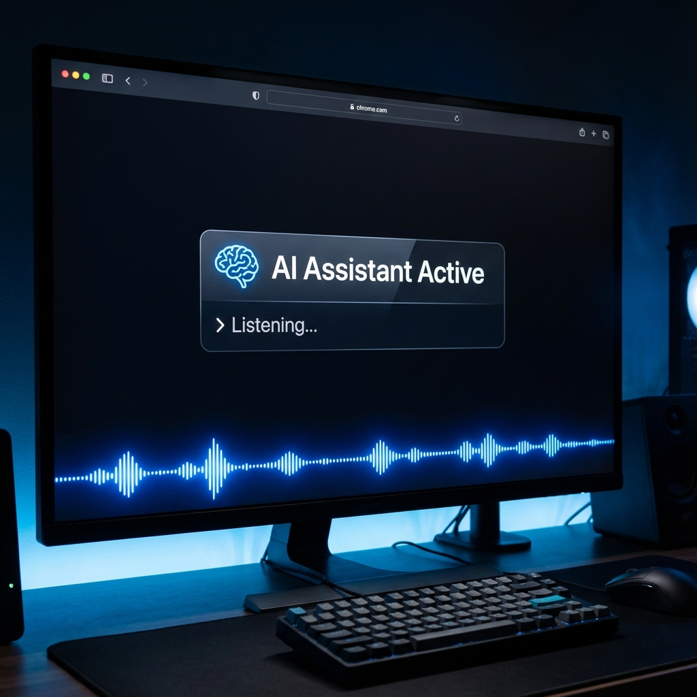
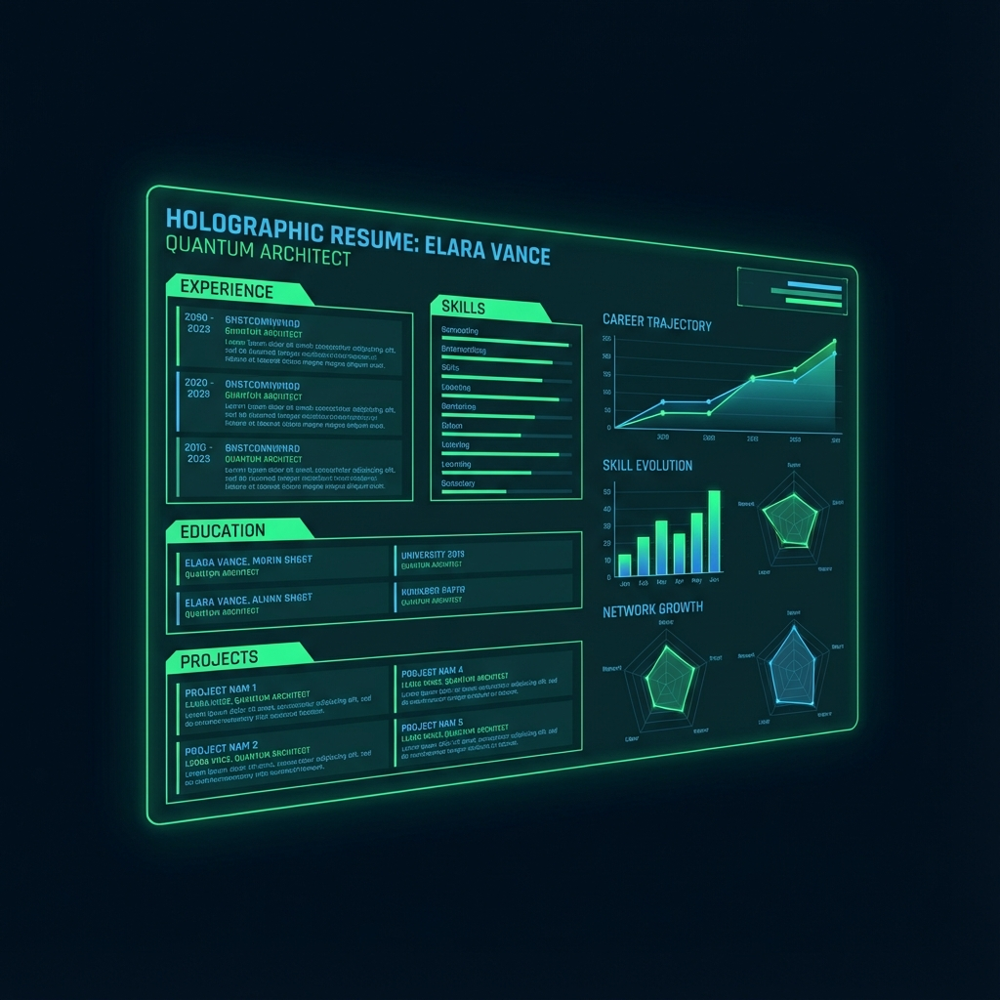

  <h1>Hi, I'm Vedant! </h1>
  
  
  
  

    <b>AI-driven Software Engineer | Full-Stack Developer | Data Science Enthusiast</b> 
    🎓 MS in Computer Science @ Syracuse University
  

   

  

    &nbsp;&nbsp;&nbsp;&nbsp;🔭 I’m currently working on **Multi-Agent Systems & AI Agents** 
    &nbsp;&nbsp;&nbsp;&nbsp;🌱 I’m currently learning **Advanced LLM Fine-tuning & RAG Pipelines** 
    &nbsp;&nbsp;&nbsp;&nbsp;👯 I’m looking to collaborate on **Open Source AI Tools** 
    &nbsp;&nbsp;&nbsp;&nbsp;💬 Ask me about **Python, React, AI Agents, and scalable systems**
  

   

   
  
  
  

 

  

---

  

## 🔧 Tech Stack

  <a href="https://skillicons.dev">
    
     
    
     
    
  </a>

  

## 🚀 Featured Projects

| [Multi-Agent Brainstorming System](https://github.com/vedant713/multi-agent-brainstorming-system) | [Zero Click Assistant Sleek](https://github.com/vedant713/zero-click-assistant-sleek) |
| :---: | :---: |
|  |  |
| **Think Deeper, Faster.**   A structured idea generation platform leveraging multiple AI agents (Debate, Research, Supervisor) to facilitate deep brainstorming and synthesis. | **Effortless Automation.**   An advanced personal assistant designed for zero-friction automation, handling tasks with minimal user interaction. |
| `Python` `Gemini` `Streamlit` | `Python` `Automation` `AI` |

| [AI Job Search Companion](https://github.com/vedant713/ai-job-search-companion) | [Workday Skills Autofill](https://github.com/vedant713/workday-skills-autofill) |
| :---: | :---: |
|  |  |
| **Your Career Copilot.**   Full-stack platform using React, Next.js, and MySQL for AI-driven job query assistance and smart task management. | **Automate the Mundane.**   Chrome extension automating Workday skill updates, reducing manual entry time by 80%. |
|    |   |

---

<h3 align="center">📈 GitHub Streak & Views</h3>

  
   
   
  
   
   
  

---

---

  

